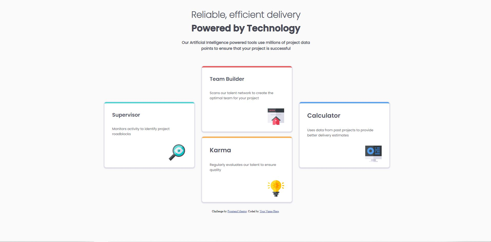

# Frontend Mentor - Four card feature section solution

This is a solution to the [Four card feature section challenge on Frontend Mentor](https://www.frontendmentor.io/challenges/four-card-feature-section-weK1eFYK). Frontend Mentor challenges help you improve your coding skills by building realistic projects. 

## Table of contents

- [Overview](#overview)
  - [The challenge](#the-challenge)
  - [Screenshot](#screenshot)
  - [Links](#links)
- [My process](#my-process)
  - [Built with](#built-with)
  - [What I learned](#what-i-learned)
  - [Continued development](#continued-development)
  - [Useful resources](#useful-resources)
- [Author](#author)
- [Acknowledgments](#acknowledgments)

**Note: Delete this note and update the table of contents based on what sections you keep.**

## Overview

This is the first practise for HTML and CSS.

### The challenge

Users should be able to:

- View the optimal layout for the site depending on their device's screen size

### Screenshot




### Links

- Solution URL: [Add solution URL here](https://github.com/morvarid61/four-card-feature-section-master)
- Live Site URL: [Add live site URL here](https://your-live-site-url.com)

## My process

### Built with


- CSS custom properties
- Flexbox
- CSS Grid
- Mobile-first workflow


### What I learned


To see how you can add code snippets, see below:

```html
<div class="Team">
      <h2>Team Builder</h2>
      <p>Scans our talent network to create the <br /> optimal team for your project</p>
      <br />
      
    </div>
```
```css
.karma {
    border-top: 5px solid #FCAE4A;
    width: 30%;
    height: 250px;
    display: inline-block;
    box-shadow: #DADAE5 0 2px 3px 3px;
    border-radius: 7px;
    position: relative;
    margin-left: 35%;
    bottom: 90px;
}
```


## Author

- Website - [Add your name here](Marjan sadat Lavassani)
- Frontend Mentor - [@yourusername](https://github.com/morvarid61)
